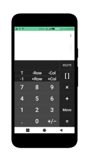
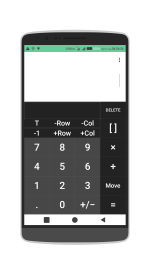
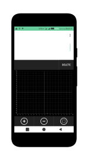
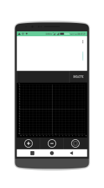
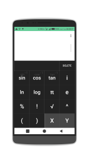
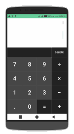

## CalcMate - A very powerful multi-dimensional/multipurpose Android Calculator app by Gigabyte Developers

Get the full version in Google Play Store

 

## ALGEBRA

	1. Solving the equation:
	2. Solve system equations
	3. Simplify expressions
	4. Polynomial factorization.
  

## ANALYTICS

	1. Definite integrals
	2. Graphing - Only single line graphical equations can be plotted at the moment (multiple line, intersects, o-give are Coming Soon)
  

## TRIGONOMETRY

	1. Trigonometric expand: sin(2x) -> 2sin(x)cos(x)
	2. Trigonometric reduce: 2sin(x)cos(x) -> sin(2x)
	3. Trigonometric to exponent: sinh(x) -> (e^x-e^(-x))/2
  

## DETERMINATION OF STATISTICS and BASIC CALCULATIONS

	1. Matrix
	2. Addition, Subtraction, Multiplication, Division, etc
  

## SOME OTHER FEATURES - (Coming Soon)

	1. Prime factors
	2. Modulo
	3. Catalan number
	4. Fibonacci number
	5. Pi number
	6. Combination
	7. Permutation
	8. Derivative
	9. Antiderivative
	10. Find the limit of the sequence, function
	11. Binomial expansion Newton
	12. Unit Conversions
	13. Currency Conversions
	14. Date;Time Calculations
	15. Electronics Calculations (Ohms, Power Triangle, Reactance, Filters), etc

## Important Notice

CalcMate can work in two modes:
- 	Decimal mode: 0.12312312323
- 	Mode fractions: for results with arbitrary precision, for example 9^99999

Fanpage support: https://www.facebook.com/gigabytedevelopersinc

Any suggestions on the application please send mail: gigabytedevelopers@gmail.com.

## License

	Copyright 2017 Nwokoma Emmanuel (Founder and CEO - Gigabyte Developers Incorporated), Martins Victor (Co-Founder and CTO - Gigabyte Developers Incorporated)

	Licensed under the Apache License, Version 2.0 (the "License");
	you may not use this file except in compliance with the License.
	You may obtain a copy of the License at

		http://www.apache.org/licenses/LICENSE-2.0

	Unless required by applicable law or agreed to in writing, software
	distributed under the License is distributed on an "AS IS" BASIS,
	WITHOUT WARRANTIES OR CONDITIONS OF ANY KIND, either express or implied.
	See the License for the specific language governing permissions and
	limitations under the License.